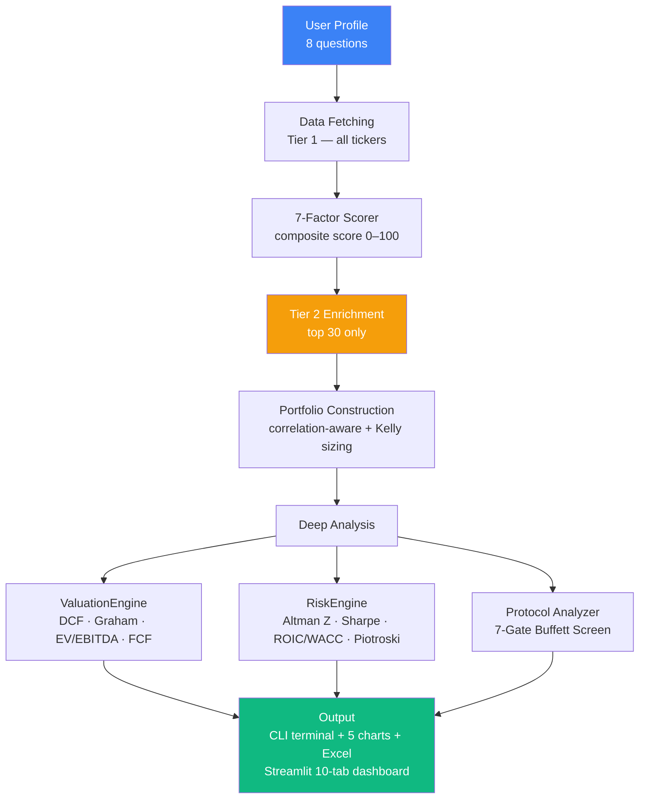
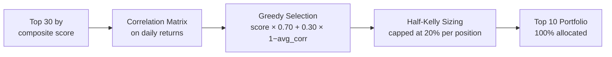

# Stock Ranking Advisor v4


> Hedge-fund grade quantitative stock analysis — entirely on free data.
> No paid APIs. No AI subscriptions. Just math, discipline, and 7 independent data sources.
> **Dark "Wall Street terminal" UI** by default — feels like Bloomberg without the $24k/year bill.

It scores up to **500 stocks** across your investor profile, runs a **7-gate Warren Buffett protocol**, computes intrinsic value via **4 independent valuation methods**, performs Monte Carlo simulations, backtests the strategy on historical prices, and delivers analysis that would cost thousands per month on a professional terminal — **for free**.

### Key Stats

| Metric | Value |
|--------|-------|
| Stocks Scored | Up to 500 per run |
| Data Sources | 7 independent (Tier 1 all-tickers + Tier 2 top-30) |
| Valuation Methods | 4 (DCF, Graham, EV/EBITDA, FCF Yield) |
| Risk Metrics | 11 (Altman Z, Sharpe, Sortino, VaR, ROIC/WACC, Piotroski, Accruals…) |
| Protocol Gates | 7 (Warren Buffett-inspired) |
| Quant Charts | 10 (5 dark CLI + 5 new interactive Plotly charts) |
| Monte Carlo Paths | 200 per run |
| Paid APIs Required | 0 |

---

## Two Ways to Run

### CLI Pipeline — terminal + 5 charts + Excel export
```bash
pip install -r requirements.txt
python main.py
```

### Streamlit Dashboard — browser-based, 10 interactive tabs
```bash
pip install -r requirements.txt
streamlit run app.py
# Opens at http://localhost:8501
```

---

## Architecture Overview



---

## The 7 Data Sources

The model draws from **7 independent free data sources** layered across two tiers:

### Tier 1 — All Tickers (parallelized, runs on every stock)

| # | Source | Data Extracted | Key |
|---|--------|---------------|-----|
| 1 | **Yahoo Finance (yfinance)** | Price history, fundamentals, news, insider trades, options IV, earnings calendar | None |
| 1b | **Yahoo Finance Extended** | `quarterly_financials` → revenue QoQ trend · `earnings_history` → EPS beat rate · `major_holders` → institutional ownership % | None |
| 2 | **Stooq CSV** | Price history fallback when yfinance returns < 63 days | None |
| 3 | **FRED API** | Recession probability · HY credit spread · Consumer sentiment · 10Y–2Y yield spread | Free key |
| 4 | **Finnhub** | Insider transactions (last 90d) · EPS surprise history (last 4Q) | Free key |

### Tier 2 — Top 30 Only (runs after initial scoring)

| # | Source | Data Extracted | Key |
|---|--------|---------------|-----|
| 5 | **Alpha Vantage** | EPS beat rate + average surprise % (last 4 quarters) | Free key |
| 6 | **Financial Modeling Prep (FMP)** | Analyst estimate revisions · Financial health rating · Revenue growth | Free key |
| 7 | **SEC EDGAR XBRL** | Revenue + net income directly from 10-Q filings (used when yfinance data is missing) | None |
| + | **Google Trends** (pytrends) | 90-day retail search interest change | None |
| + | **Reddit RSS** | r/stocks + r/investing mention sentiment | None |
| + | **Yahoo Finance options** | Put/call ratio · IV rank | None |

---

## The 7-Factor Scoring Model

Each stock is scored **0–100** on 7 independent factors, combined using a weight matrix tuned to your risk profile and time horizon.

```
composite = w1×momentum + w2×volatility + w3×value + w4×quality
          + w5×technical + w6×sentiment + w7×dividend
```

### Factor 1 — Momentum _(12-1 skip-month, academic grade)_
Avoids the 1-month reversal effect documented in academic literature:
```
momentum = 0.10×r1m + 0.25×r3m + 0.35×r6m + 0.30×r12_1
```
**Boosts:** short squeeze potential (>15% float short) · sector outperformance vs ETF · EPS beat rate · revenue QoQ acceleration · Finnhub earnings surprise magnitude

### Factor 2 — Volatility
Annualised daily return standard deviation — **inverted** (low vol = high score).

### Factor 3 — Value _(3-signal composite)_
```
value = 0.40 × (P/E vs sector median)
      + 0.35 × (EV/EBITDA vs sector median)
      + 0.25 × (FCF yield)
```

### Factor 4 — Quality _(5 signals)_
```
quality = Piotroski(8pt) × 0.60
        + ROE/Profit Margin blend × 0.40
        + Accruals quality adjustment   (−0.20 to +0.20)
        + Gross Profitability (Novy-Marx 2013)
        + Revenue trend QoQ             (−0.10 to +0.10)
        + EPS beat rate                 (−0.10 to +0.10)
        + Institutional ownership       (−0.05 to +0.06)
```

### Factor 5 — Technical _(5 sub-signals)_
| Sub-signal | Weight | Logic |
|------------|--------|-------|
| RSI (14d) | 25% | Sweet spot 40–65; oversold <30 = contrarian buy |
| MACD 12/26/9 | 30% | Line vs signal vs histogram direction |
| MA crossover | 20% | Price > SMA50 > SMA200 = golden alignment; golden cross bonus +12pts |
| Bollinger %B | 15% | Buy zone 0.20–0.65; near upper band = overbought warning |
| OBV trend | 10% | 20d SMA > 50d SMA = smart-money accumulation |

### Factor 6 — Sentiment _(5-source composite)_

**Tier 1 (all tickers):**
```
sentiment = 0.45 × news_score    (20 articles, negation-aware, recency-weighted 1.5×/1.2×/1.0×)
          + 0.35 × insider_score  (yfinance + Finnhub insider transactions, last 90d)
          + 0.20 × analyst_score  (rec key + target upside + coverage breadth)
```

**Tier 2 (top 30 — upgraded to full 5-source):**
```
sentiment = 0.30 × news_score
          + 0.25 × insider_score
          + 0.20 × analyst_score  (blended with FMP analyst revision)
          + 0.15 × options_score  (put/call ratio + IV premium)
          + 0.10 × retail_score   (Google Trends 60% + Reddit RSS 40%)
```

### Factor 7 — Dividend
Raw yield, capped at 15%. Heavily weighted only for income-focused profiles.

---

## Valuation Engine — 4 Independent Methods

Every stock in the top 10 is valued four independent ways:

| Method | Formula | Captures |
|--------|---------|----------|
| **DCF (2-stage)** | FCF/share × 5yr growth + terminal value, discounted at `rf + sector_erp + size_premium` | Future cash generation |
| **Graham Number** | `√(22.5 × EPS × Book/share)` | Graham's classic intrinsic value |
| **EV/EBITDA Target** | `EBITDA × sector_median_multiple → implied price` | How market values sector peers |
| **FCF Yield Target** | `FCF/share ÷ (rf + 3%)` | Price at a dynamic FCF return target |

**Dynamic discount rate** — no more hard-coded 10%:
```python
DR = rf_rate + SECTOR_ERP[sector] + size_premium
# Example: 5% rf + 6.0% tech ERP + 1.0% mid-cap = 12.0%
```

**Signals:** `STRONG_BUY` (≤entry_low) · `BUY` (≤entry_high) · `HOLD_WATCH` (≤FV) · `WAIT` (≤FV×1.10) · `AVOID_PEAK` (>FV×1.10)

**DCF Sensitivity** — Bear / Base / Bull scenario table (50% / 100% / 150% of base growth):

| Scenario | Growth | Fair Value | Signal |
|----------|--------|-----------|--------|
| Bear | g × 0.50 | lower | ... |
| Base | g × 1.00 | calculated | ... |
| Bull | g × 1.50 | higher | ... |

---

## Risk Engine — Full Institutional Suite

| Metric | Formula / Logic |
|--------|----------------|
| **Altman Z-Score** | 5-factor bankruptcy predictor → SAFE (>2.6) / GRAY / DISTRESS (<1.1) |
| **Sharpe Ratio** | `(annualised_return − rf) / annualised_vol` |
| **Sortino Ratio** | Sharpe using downside deviation only |
| **Max Drawdown** | Worst peak-to-trough % over the full period |
| **VaR 95% (1mo)** | 5th percentile of 21-day rolling return distribution |
| **ROIC / WACC** | `ROIC − WACC` spread → EXCEPTIONAL / STRONG / POSITIVE / NEUTRAL / DESTROYING VALUE |
| **Full WACC** | `(E/V)×cost_equity + (D/V)×cost_debt×(1−tax)` using Modigliani-Miller |
| **Accruals Ratio** | `(NI − OCF) / Assets` — negative = earnings backed by cash |
| **Gross Profitability** | `(Revenue × Gross Margin) / Assets` — Novy-Marx (2013) anomaly factor |
| **Piotroski F-Score** | Full 9-point screen: 3 profitability + 3 leverage + 3 efficiency |
| **IV Rank** | `(current_iv / hist_vol×1.15 − 0.5) × 1.25` — >0.70 = elevated fear |

---

## The 7-Gate Investment Protocol

Every top-10 stock is run through a Warren Buffett–inspired 7-gate screen:

| Gate | Weight | What It Checks |
|------|--------|----------------|
| 1. Business Quality | 20% | ROA, ROE, FCF yield, profit margins, earnings growth |
| 2. Competitive Moat | 15% | Gross margins, operating margins, revenue scale |
| 3. Financial Health | 15% | Debt/equity, current ratio, interest coverage, Altman Z |
| 4. Valuation | 22% | ValuationEngine signal (65%) + P/E vs sector median (35%) |
| 5. Technical Entry | 10% | 52-week positioning, analyst consensus upside, forward P/E |
| 6. News & Sentiment | 8% | Multi-source sentiment score + analyst recommendation |
| 7. Trend Alignment | 10% | SMA200 trend, SMA50 crossover, 3-month momentum |

**Thresholds:** PASS ≥60 · WARN 35–59 · FAIL <35
**Conviction:** HIGH (≤1 fail, ≥70 overall, ≥6 pass) · MEDIUM (≤2 fails) · LOW (3+ fails)

---

## Macro Regime Detection

The MacroFetcher aggregates **7 crash signals** from live market data and FRED:

| Signal | Trigger |
|--------|---------|
| VIX velocity | >7 pts in 5 days (panic spike) |
| HYG 1-month return | < −3% (credit markets seizing) |
| Yield curve (3M vs 10Y) | 3M > 10Y (inverted — recession warning) |
| SPY drawdown | >12% off 52-week high (bear territory) |
| VIX absolute | > 35 (extreme fear) |
| FRED recession probability | > 30% (RECPROUSM156N) |
| FRED HY credit spread | > 5% OAS (BAMLH0A0HYM2) |

**Regime → Score Tilts:**

| Regime | Trigger | Tilt |
|--------|---------|------|
| Risk-On | VIX < 16 | +4 Tech, +3 Consumer, −5 Utilities |
| Risk-Off | VIX > 27 | +7 Utilities, +5 Healthcare, −4 Tech |
| Rising Rate | 10Y up >0.35% / 1mo | +5 Financials, +3 Energy, −7 REITs, −5 Utilities |
| Falling Rate | 10Y down >0.30% | +5 REITs, +5 Utilities, +3 Tech, −3 Financials |
| Pre-Crisis | 2 crash signals | +8 Utilities, +6 Healthcare, −6 Tech, −6 REITs |
| Crisis | 3+ crash signals | +15 Utilities, +10 Healthcare, −15 Tech, −12 REITs |

FRED consumer sentiment and 10Y–2Y yield spread add additional context to regime classification when `FRED_KEY` is set.

---

## The 8-Question Investor Profile

| # | Question | Impact |
|---|----------|--------|
| 1 | Portfolio size ($1K – $1B) | Dollar allocations in the output table |
| 2 | Time horizon (1 / 3 / 5 yr) | Short → momentum-heavy; Long → value + quality |
| 3 | Risk tolerance (1–4) | Controls beta filters + factor weight distribution |
| 4 | Investment goal | Income goal lifts dividend weight; speculative lifts momentum |
| 5 | Drawdown tolerance | Adds volatility penalty when `drawdown_ok < 20%` |
| 6 | Sector focus / exclusions | Filters universe; preferred sectors get quality/momentum boost |
| 7 | Existing holdings | Removed from recommendations to avoid overlap |
| 8 | **Fresh picks mode** | −22 pts to last 2 sessions' picks → forces entirely new ideas |

---

## Weight Matrix

Factor weights auto-selected by `(risk_level, time_horizon)`:

| Profile | Momentum | Volatility | Value | Quality | Technical | Sentiment | Dividend |
|---------|----------|-----------|-------|---------|-----------|-----------|----------|
| Conservative / Short | 10% | 28% | 18% | 18% | 7% | 4% | 15% |
| Conservative / Long | 5% | 18% | 27% | 25% | 5% | 5% | 15% |
| Balanced / Medium | 18% | 14% | 22% | 25% | 11% | 5% | 5% |
| Aggressive / Short | 38% | 7% | 12% | 22% | 16% | 5% | 0% |
| Speculative / Medium | 35% | 4% | 12% | 28% | 16% | 5% | 0% |

Weights adapt over time via **adaptive learning** (see below).

---

## Portfolio Construction



Each position size uses **half-Kelly criterion**:
```
kelly_f = edge / odds
position = kelly_f * 0.5     # half-Kelly = conservative
```

---

## Backtest Strategy

Simulates our valuation entry strategy on historical daily closes:

| Rule | Trigger | Action |
|------|---------|--------|
| **Entry** | Price ≤ FV × 0.80 | Buy — 20% margin of safety |
| **Take Profit** | Price ≥ FV × 1.20 | Sell — 20% above fair value |
| **Stop Loss** | Price ≤ entry × 0.92 | Sell — 8% below entry price |

**Output:** Equal-weighted portfolio equity curve vs S&P 500 · Win rate · Portfolio return · Alpha · Per-stock breakdown · Per-trade log

> Uses current fair values as static levels — historical fundamentals vary; treat as illustrative.

---

## Adaptive Learning

Every session is saved to `memory/history.json`. After 30+ days:

```
1. Fetch current prices for all past picks
2. Compute each pick's return vs S&P 500
3. Pearson correlation → which factors predicted returns?
4. Factors with avg r > 0.3 → weight +4%
   Factors with avg r < 0.0 → weight −4%
5. Renormalise + floor at 3%
```

Additional learned layers:
- **Dynamic sector tilts** (observed sector performance by regime)
- **Sector-specific factor weight adjustments** (Layer 2 intelligence)
- **Pattern bonuses** (similarity to historical winners/losers)
- **Fresh picks penalty** (avoid repeating last 2 sessions)

---

## Streamlit Dashboard — 10 Tabs

| Tab | What You Get |
|-----|-------------|
| **1. Rankings** | Top-3 pick cards with signal + conviction + earnings badges; full rankings table; **factor radar chart** (7-factor fingerprint, top-5); **score distribution histogram** (portfolio vs universe); per-stock detail panel |
| **2. Valuation** | 4-method matrix; entry positioning chart; DCF sensitivity Bear/Base/Bull table; **DCF scenario waterfall chart** (grouped Bear/Base/Bull bars with current price) |
| **3. Risk & Quality** | Risk metrics table; Sharpe vs ROIC bubble scatter; Piotroski bar chart; **Monte Carlo portfolio simulation** (200 paths, 252 days, P5/P25/P75/P95 bands) |
| **4. Protocol Gates** | 10×7 gate heatmap; protocol summary with pass/warn/fail |
| **5. Portfolio** | Donut allocation chart; position breakdown with Kelly weights |
| **6. Macro & Performance** | VIX + yield tiles; sector ETF bar chart; normalised price history vs S&P 500; correlation heatmap; **yield curve chart** (3M/2Y/10Y — red fill if inverted) |
| **7. Stock Lookup** | Search any ticker — full fresh analysis with candlestick, valuation, risk, news, protocol |
| **8. History** | Past sessions with per-pick cards · factor score bars · entry/exit P&L · "📊 Open Full Analysis" time-machine view |
| **9. Backtest** | Portfolio-wide equity curve vs S&P 500 · 5 aggregate tiles · per-stock breakdown |
| **10. Calendar** | Earnings timeline sorted by urgency (≤7d RED · ≤14d AMBER · ≤30d BLUE) · Wall Street-style quant recommendation per stock · Bear/Base/Bull targets |
| **⚙️ Settings** | Theme switcher (**Terminal** / Dark / Light / Warm) · CSV/JSON export · behaviour sliders (penalty, memory, learning rate, signal mode) |

---

## CLI Slash Commands

After the analysis pipeline completes, the terminal enters an interactive REPL:

```
/stock AAPL         → Full quant report: thesis · valuation · DCF sensitivity
                       risk metrics · analyst targets · technical · protocol · financials
/news AAPL [15]     → Headlines with per-article sentiment colour coding
/chart AAPL [6mo]   → Dark-theme candlestick + SMA 20/50/200 + RSI panel
/compare AAPL MSFT  → Side-by-side: price · P/E · EV/EBITDA · Sharpe · Piotroski · signal
/add AAPL           → Add to persistent watchlist (memory/watchlist.json)
/remove AAPL        → Remove from watchlist
/watchlist          → Show watchlist with live prices
/macro              → VIX · 10Y yield · regime · sector ETF returns
/history [n]        → Past sessions — win rate · alpha · per-pick returns
/exit               → Exit
```

---

## CLI Charts — 5 Dark-Theme PNGs

| File | Contents |
|------|----------|
| `chart1_score_breakdown.png` | Stacked horizontal bars — factor contribution per stock (dark theme) |
| `chart2_performance.png` | Normalised price history vs S&P 500 benchmark |
| `chart3_factor_heatmap.png` | 10 × 7 colour grid of all factor scores |
| `chart4_macro_dashboard.png` | VIX · 10Y yield history · sector ETF returns · correlation matrix |
| `chart5_quant_protocol.png` | Gate scorecard · entry price positioning · quant thesis per stock |

---

## Excel Export — Book1.xlsx (6 Sheets)

| Sheet | Contents |
|-------|----------|
| Latest Picks | Top 10 with all 7 factor scores and composite |
| Allocation | Weight %, dollar amounts, approx share counts |
| Macro Overview | VIX, 10Y yield, regime, sector ETF rankings |
| History | All past sessions with tickers and entry prices |
| Track Record | Evaluated sessions — avg return, S&P return, alpha |
| Deep Analysis | Gate scorecard · 4-method valuation detail · Risk metrics |

---

## Setup

### 1. Install dependencies
```bash
pip install -r requirements.txt
```

### 2. Configure API keys (optional — tool works without them)

Copy `.env.example` to `.env` and fill in your keys:
```bash
cp .env.example .env
```

```ini
# .env
FINNHUB_KEY      = ""    # finnhub.io — free, 60 calls/min (news, insider, earnings)
NEWSAPI_KEY      = ""    # newsapi.org — free, 100 req/day (broad news search)
FRED_KEY         = ""    # fred.stlouisfed.org — free, unlimited (macro series)
ALPHAVANTAGE_KEY = ""    # alphavantage.co — free, 25 calls/day (EPS surprise history)
FMP_KEY          = ""    # financialmodelingprep.com — free, 250 calls/day (analyst revisions)
```

All keys are optional. Without them the tool uses yfinance + EDGAR + Stooq which are fully free and keyless.

### 3. Run
```bash
# Terminal pipeline
python main.py

# Web dashboard
streamlit run app.py
```

---

## File Structure

```
portfolio/
├── main.py                   ← 16-step CLI pipeline + interactive command loop
├── app.py                    ← Streamlit dashboard (10 tabs + settings)
├── config.py                 ← Universe · weight matrix · sector multiples · API keys · SECTOR_ERP
├── requirements.txt
├── .env                      ← Your API keys (never committed — in .gitignore)
├── .env.example              ← Key template (committed, no values)
├── .streamlit/
│   └── config.toml           ← Wall Street terminal theme (dark bg · neon green/red)
├── advisor/
│   ├── collector.py          ← 8-question investor profile builder
│   ├── fetcher.py            ← yfinance + yfinance-extended + Stooq fallback
│   │                            + FRED extended macro + Finnhub signals
│   ├── scorer.py             ← 7-factor MultiFactorScorer (revenue trend · EPS beat rate
│   │                            · institutional % · short interest · sector relative strength)
│   ├── alternative_data.py   ← Tier 2 enrichment: options · Google Trends · Reddit
│   │                            · Alpha Vantage EPS · FMP revisions · SEC EDGAR XBRL
│   ├── portfolio.py          ← Greedy correlation-aware selection + half-Kelly sizing
│   ├── valuation.py          ← DCF · Graham · EV/EBITDA · FCF yield (dynamic DR)
│   ├── risk.py               ← Altman Z · Sharpe · Sortino · full WACC · IV rank · Piotroski
│   ├── protocol.py           ← 7-gate Warren Buffett investment protocol
│   ├── learner.py            ← Session memory · adaptive weights · pattern bonuses
│   ├── news_fetcher.py       ← yfinance + RSS feeds + Finnhub + NewsAPI (negation-aware)
│   ├── cli_commands.py       ← Interactive REPL (/stock /news /chart /compare …)
│   ├── charts.py             ← 5 dark-theme matplotlib charts + candlestick
│   ├── display.py            ← Rich terminal output + deep analysis formatting
│   ├── exporter.py           ← Excel 6-sheet export
│   └── universe.py           ← Dynamic US market universe fetcher (NASDAQ API)
├── memory/
│   ├── history.json          ← Auto-created session log (gitignored)
│   ├── watchlist.json        ← CLI /add watchlist (gitignored)
│   └── settings.json         ← Web dashboard settings (gitignored)
└── Book1.xlsx                ← Auto-generated on each CLI run (gitignored)
```

---

## Dependencies

```
yfinance>=0.2.36       # primary data source
pandas>=2.0.0
numpy>=1.24.0
matplotlib>=3.7.0
rich>=13.0.0           # terminal formatting
openpyxl>=3.1.0        # Excel export
streamlit>=1.32.0      # web dashboard
plotly>=5.18.0         # interactive charts
mplfinance>=0.12.9     # candlestick charts
feedparser>=6.0.0      # RSS news feeds
requests>=2.31.0       # HTTP calls (Stooq · FRED · FMP · AV · SEC EDGAR)
pytrends>=4.9.0        # Google Trends
python-dotenv>=1.0.0   # .env loader
```

No paid data subscriptions required.

---

## Disclaimer

This tool is for **educational and informational purposes only**.
Past performance does not guarantee future results.
Rankings, valuations, and backtest results are quantitative model outputs — **not financial advice**.
Always conduct your own due diligence before making investment decisions.
