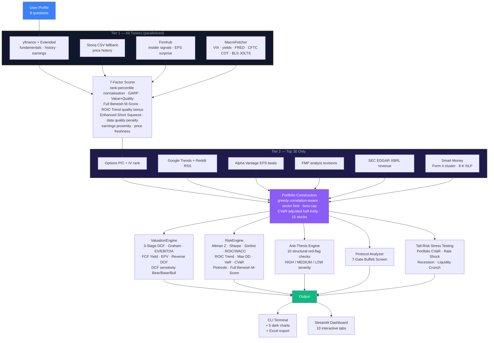
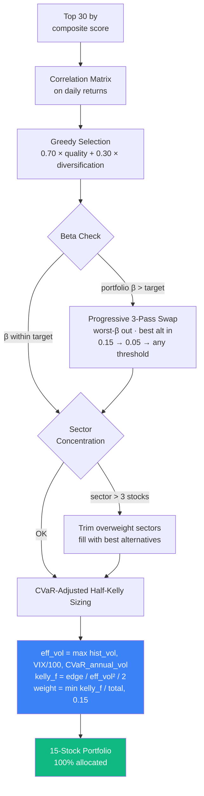
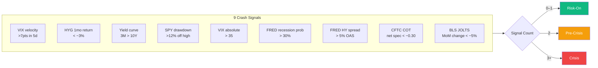
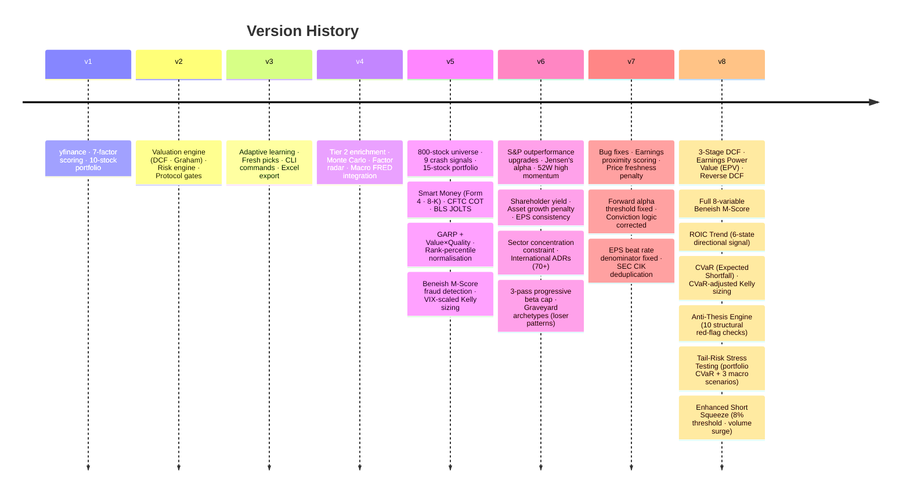

# Stock Ranking Advisor v8

[](https://investing-ml.streamlit.app/)


> Hedge-fund grade quantitative stock analysis — entirely on free data.
> No paid APIs. No AI subscriptions. Just math, discipline, and **9 independent data sources**.
> **Dark "Wall Street terminal" UI** by default — feels like Bloomberg without the $24k/year bill.

Scores up to **800 stocks** across your investor profile, runs a **7-gate Warren Buffett protocol**, computes intrinsic value via **5 independent valuation methods** (including Reverse DCF and Earnings Power Value), detects earnings manipulation via the full **8-variable Beneish M-Score**, stress-tests your portfolio with **CVaR tail-risk scenarios**, surfaces a structured **Anti-Thesis bear case** for every pick, monitors **9 live crash signals**, simulates **200 Monte Carlo paths**, backtests the strategy on historical prices, and delivers institutional-grade analysis — **for free**.

---

## Try It Live — No Installation Required

**Don't want to clone a repo or touch a terminal? The full dashboard is hosted and ready to use:**

### [investing-ml.streamlit.app](https://investing-ml.streamlit.app/)

Open the link, set your investor profile in the sidebar (portfolio size, risk level, time horizon), hit **Run Analysis**, and get a full institutional-grade stock ranking in minutes — straight from your browser.

**What you get on the live app:**
- Complete 10-tab Streamlit dashboard with all features
- Real-time data pulled fresh on every run (yfinance, SEC EDGAR, FRED, Finnhub, FMP)
- 5-method valuation — DCF (3-stage), Graham Number, EV/EBITDA, FCF Yield, Earnings Power Value
- Reverse DCF: see exactly what growth rate the market has already priced in
- Anti-Thesis bear case engine for every pick
- CVaR tail-risk stress testing with 3 macro shock scenarios
- 9-signal crash detection + macro regime scoring
- Portfolio construction with CVaR-adjusted half-Kelly sizing and sector limits
- Backtesting, earnings calendar, stock lookup — all included

> **Note:** The hosted app runs on Streamlit Community Cloud (free tier). First-run analysis across 800 stocks can take 3–5 minutes as data is fetched live. Session history and watchlist data do not persist between restarts on the cloud — for persistent learning and the full CLI pipeline with Excel export and dark charts, run it locally (see [Setup](#setup) below).

---

## Dashboard


*Rankings tab — macro environment tiles, top-3 pick cards with valuation signal + conviction + entry zone, and 10 interactive tabs*

---

## Key Stats

| Metric | Value |
|--------|-------|
| Stocks Scored | Up to **800** per run (dynamic NASDAQ universe) |
| Data Sources | **9 independent** (Tier 1 all-tickers + Tier 2 top-30 + Smart Money) |
| Valuation Methods | **5** (3-Stage DCF, Graham, EV/EBITDA, FCF Yield, Earnings Power Value) |
| Valuation Checks | **+1 Reverse DCF** — implied growth vs realistic growth analysis |
| Risk Metrics | **14** (Altman Z, Sharpe, Sortino, VaR, **CVaR**, ROIC/WACC, **ROIC Trend**, Piotroski, Beneish M…) |
| Protocol Gates | 7 (Warren Buffett-inspired) |
| Crash Signals | **9** (VIX, HYG, yield curve, SPY drawdown, FRED, CFTC COT, BLS JOLTS) |
| Monte Carlo Paths | 200 per run (252 trading days) |
| Portfolio Size | **15 stocks** with sector concentration limit (max 3/sector) |
| Position Sizing | **CVaR-adjusted** half-Kelly (uses tail-risk, not just volatility) |
| Position Cap | 15% per position |
| Paid APIs Required | **0** |

---

## Three Ways to Run

### Option 1 — Hosted Web App (no setup)
**Just open the browser:** [investing-ml.streamlit.app](https://investing-ml.streamlit.app/)
No Python, no terminal, no installation. Works on any device with a browser.

### Option 2 — Local Streamlit Dashboard (full featured, persistent)
```bash
git clone https://github.com/Justme-Cliff/Investing-ML.git
cd Investing-ML
pip install -r requirements.txt
streamlit run app.py
# Opens at http://localhost:8501
```
Same 10-tab dashboard as the hosted version, plus persistent session learning across runs.

### Option 3 — CLI Pipeline (terminal power users)
```bash
pip install -r requirements.txt
python main.py
```
Full 16-step terminal pipeline with Rich output, 5 auto-generated dark-theme charts, Excel export, and an interactive REPL (`/stock`, `/compare`, `/chart`, `/macro` and more).

---

## Rankings — Full 15-Stock Table


*Every pick shows composite score, valuation signal, conviction level, fair value, entry zone (20% MoS), stop loss, and earnings date*

---

## Architecture Overview



---

## The 9 Data Sources

### Tier 1 — All Tickers (runs on every stock, parallelized)

| # | Source | Data Extracted | Key |
|---|--------|---------------|-----|
| 1 | **Yahoo Finance** | Price history, fundamentals, news, insider trades, options IV, earnings calendar | None |
| 1b | **Yahoo Finance Extended** | Revenue QoQ trend · EPS beat rate · Institutional ownership % · Asset growth · Buyback yield · EPS consistency | None |
| 2 | **Stooq CSV** | Price history fallback when yfinance returns < 63 days | None |
| 3 | **FRED API** | Recession probability · HY credit spread · Consumer sentiment · 10Y–2Y spread | Free key |
| 4 | **Finnhub** | Insider transactions (last 90d) · EPS surprise history (last 4Q) | Free key |
| 4b | **CFTC COT** | E-mini S&P 500 net speculator positioning (weekly ZIP) | None |
| 4c | **BLS JOLTS** | Job openings rate + monthly change | Free key |

### Tier 2 — Top 30 Only (enrichment after initial scoring)

| # | Source | Data Extracted | Key |
|---|--------|---------------|-----|
| 5 | **Alpha Vantage** | EPS beat rate + average surprise % (last 4 quarters) | Free key |
| 6 | **Financial Modeling Prep** | Analyst estimate revisions · Financial health rating · Revenue growth | Free key |
| 7 | **SEC EDGAR XBRL** | Revenue from 10-Q filings (when yfinance data is missing) | None |
| 8 | **SEC EDGAR Form 4** | Distinct insider buyer cluster (last 60 days) | None |
| 9 | **SEC EDGAR 8-K NLP** | Event sentiment: positive filings vs negative (write-offs, departures) | None |
| + | **Google Trends** | 90-day retail search interest change | None |
| + | **Reddit RSS** | r/stocks + r/investing mention sentiment | None |
| + | **Yahoo Finance options** | Put/call ratio · IV rank | None |

---

## The 7-Factor Scoring Model

Each stock is scored **0–100** on 7 independent factors using **rank-percentile normalisation** (outlier-robust), combined with a weight matrix tuned to your risk profile and time horizon.

```
composite = w1×momentum + w2×volatility + w3×value + w4×quality
          + w5×technical + w6×sentiment + w7×dividend

+ GARP bonus:      (momentum/100) × (quality/100) × 15    ← Asness (1997)
+ VQ bonus:        (value/100)    × (quality/100) × 10    ← Frazzini & Pedersen (2019)
− data quality:    stocks with <60% fundamental coverage lose up to −12 pts
− factor crowding: −4 pts if composite correlates >0.92 with a single factor
− price freshness: up to −7 pts for stale data (>7 days old)
− earnings risk:   −4/−2.5/−1/0 pts (by risk level) when earnings ≤7 days away
```

### Factor 1 — Momentum _(12-1 skip-month, academic grade)_
```
momentum = 0.10×r1m + 0.25×r3m + 0.35×r6m + 0.30×r12_1
```
**Boosts:** Enhanced short squeeze (progressive 8%→28% float · volume surge) · sector outperformance vs ETF · EPS beat rate · revenue QoQ · Finnhub EPS surprise · **Jensen's alpha** (market-adjusted) · **52-week high proximity**

**Short Squeeze Score (v8 enhanced):**
```
squeeze = min(0.10, (short_pct − 0.08) × 0.50)  +  min(0.04, (vol_ratio − 1.2) × 0.04)
# Activates at 8% float (was 15%) · volume surge amplifies signal
# Positive momentum: squeeze fuel  |  Negative momentum: confirms short thesis
```

### Factor 2 — Volatility
Annualised daily σ — **inverted** (low vol = high score). Beta-aware scaling for regime adjustment.

### Factor 3 — Value _(3-signal composite)_
```
value = 0.40 × (P/E vs sector median)
      + 0.35 × (EV/EBITDA vs sector median)
      + 0.25 × (FCF yield)
      + shareholder yield bonus (dividends + buybacks)
```

### Factor 4 — Quality _(10 signals)_
```
quality = Piotroski(9pt) × 0.60
        + ROE/Profit Margin blend × 0.40
        + Accruals quality adjustment
        + Gross Profitability (Novy-Marx 2013)
        + Revenue QoQ trend
        + EPS beat rate
        + Institutional ownership
        + ROIC Trend bonus (EXPANDING +0.06 / IMPROVING +0.03)
        − ROIC Trend penalty (CONTRACTING −0.05 / NEGATIVE −0.08)
        − Asset growth penalty (Cooper 2008)
        − Full Beneish M-Score fraud penalty
```

**Full Beneish M-Score (v8 — 8-variable):**
```
M = -4.84 + 0.920×DSRI + 0.528×GMI + 0.404×AQI + 0.892×SGI
         + 0.115×DEPI  - 0.172×SGAI + 4.679×TATA - 0.327×LVGI

M > −1.78 → manipulation flag → quality penalty up to 12%
# TATA, SGI, GMI, AQI, LVGI, SGAI computed from live data
# DSRI, DEPI use Beneish non-manipulator means where prior-year unavailable
```

**ROIC Trend (v8 new):**
```
gap = earningsGrowth − revenueGrowth   # earnings outpacing revenue = margin expansion

EXPANDING:   ROA > 12% AND gap > 5%   → +0.06 quality bonus
IMPROVING:   ROA > 6%  AND gap > 0%   → +0.03 quality bonus
STABLE:      ROA > 0%  AND |gap| < 5% → no adjustment
CONTRACTING: gap < −10%               → −0.05 quality penalty
NEGATIVE:    ROA < 0                  → −0.08 quality penalty
```

### Factor 5 — Technical _(5 sub-signals)_
| Sub-signal | Weight | Logic |
|------------|--------|-------|
| RSI (14d) | 25% | Sweet spot 40–65; oversold <30 = contrarian buy signal |
| MACD 12/26/9 | 30% | Line vs signal vs histogram direction |
| MA crossover | 20% | Price > SMA50 > SMA200; golden cross bonus +12pts |
| Bollinger %B | 15% | Buy zone 0.20–0.65; near upper band = overbought warning |
| OBV trend | 10% | 20d SMA > 50d SMA = smart-money accumulation |

### Factor 6 — Sentiment _(5-source composite in Tier 2)_
```
Tier 1:  0.45×news + 0.35×insider + 0.20×analyst
Tier 2:  0.30×news + 0.25×insider + 0.20×analyst + 0.15×options + 0.10×retail
```
News: 20 articles, negation-aware, recency-weighted (1.5× <3d · 1.2× <7d)

### Factor 7 — Dividend
Raw yield, capped at 15%. Heavily weighted for income-focused profiles.

---

## Valuation Engine — 5 Independent Methods


*5-method valuation matrix — 3-Stage DCF, Graham Number, EV/EBITDA, FCF Yield, EPV — with fair value, entry zone, stop loss, R/R ratio, and signal*

| Method | Formula | Captures |
|--------|---------|----------|
| **3-Stage DCF** | Stage 1 (yr 1–5): blended analyst growth · Stage 2 (yr 6–10): fade to GDP rate · Stage 3: terminal at 2.5% | Future cash generation with realistic mean reversion |
| **Graham Number** | `√(22.5 × EPS × Book/share)` | Graham's classic intrinsic value ceiling |
| **EV/EBITDA Target** | `EBITDA × sector_median_multiple → implied price` | How the market values sector peers |
| **FCF Yield Target** | `FCF/share ÷ (rf + 3%)` | Price at a dynamic FCF return target |
| **Earnings Power Value** | `NOPAT / WACC` — zero-growth perpetuity, net-debt adjusted | What the business is worth assuming no future growth |

**Why 3-Stage DCF matters:**
The old 2-stage model snapped directly from high growth to terminal — mis-pricing the fade period. Stage 2 (years 6–10) linearly decelerates growth toward 2.5% GDP, modelling the competitive erosion that always eventually arrives.

**Earnings Power Value (EPV) — Bruce Greenwald:**
```
EPV = EBITDA × (1 − tax) / WACC   (perpetuity, zero growth)
# If EPV > current_price: growth is free → safest possible entry
# If EPV < current_price: you are paying for growth → high risk if it disappoints
```

**Dynamic discount rate:**
```python
DR = rf_rate + SECTOR_ERP[sector] + size_premium
# Example: 4.5% rf + 6.0% tech ERP + 1.0% mid-cap = 11.5%
```

**Entry / Exit levels:**
```
Entry zone:  FV × 0.80  (20% margin of safety — Benjamin Graham rule)
Target:      FV × 1.20  (take profit)
Stop loss:   entry × 0.92  (8% downside protection)
```

### Reverse DCF — Implied Growth Analysis (v8 new)

**The most intellectually honest valuation check.** Instead of projecting forward, it asks: *"At the current price, what growth rate does the market already assume?"*

```
Bisection solver over 3-stage DCF:
  find g such that DCF(g) = current_price
  compare implied g vs realistic analyst estimate

Gap = implied_growth − realistic_growth

OVERPRICED:         gap > +15%  (market assumes far more than achievable)
STRETCHED:          gap > +5%
FAIR:               gap ±3%
ATTRACTIVE:         gap < −3%   (market prices in less than realistic)
DEEPLY_UNDERVALUED: gap < −10%  (growth is priced in at a discount)
```

Displayed as a dedicated card in every stock detail panel.

**DCF Sensitivity — Bear / Base / Bull:**


*Entry price positioning (% vs fair value), valuation method spread scatter, and DCF sensitivity table across three growth scenarios*

| Scenario | Growth Assumption |
|----------|------------------|
| Bear | base growth × 0.50 |
| Base | blended revenue + earnings growth |
| Bull | base growth × 1.50 (capped at 30%) |

---

## Risk Engine — Full Institutional Suite


*Sharpe vs ROIC/WACC scatter, Piotroski F-Score bars, Monte Carlo simulation (200 paths, 252 trading days), Anti-Thesis bear case flags, and CVaR tail-risk stress table*

| Metric | Formula / Logic |
|--------|----------------|
| **Altman Z-Score** | 5-factor bankruptcy predictor → SAFE (>2.6) / GRAY / DISTRESS (<1.1) |
| **Sharpe Ratio** | `(annualised_return − rf) / annualised_vol` |
| **Sortino Ratio** | Sharpe using downside deviation only |
| **Max Drawdown** | Worst peak-to-trough % over the full period |
| **VaR 95% (1mo)** | 5th percentile of 21-day rolling return distribution |
| **CVaR 95% (1mo)** | Mean loss across all observations below VaR threshold — captures tail severity |
| **ROIC / WACC** | `ROIC − WACC` spread → EXCEPTIONAL / STRONG / POSITIVE / NEUTRAL / DESTROYING VALUE |
| **ROIC Trend** | EXPANDING / IMPROVING / STABLE / DECLINING / CONTRACTING / NEGATIVE |
| **Full WACC** | `(E/V)×cost_equity + (D/V)×cost_debt×(1−tax)` — Modigliani-Miller |
| **Accruals Ratio** | `(NI − OCF) / Assets` — negative = earnings backed by real cash |
| **Gross Profitability** | `(Revenue × Gross Margin) / Assets` — Novy-Marx (2013) |
| **Piotroski F-Score** | Full 9-point screen: profitability + leverage + efficiency |
| **Full Beneish M-Score** | 8-variable manipulation detector → M > −1.78 = possible manipulator |
| **IV Rank** | `(current_iv / hist_vol×1.15 − 0.5) × 1.25` — >0.70 = elevated fear |

**CVaR vs VaR:**
```
VaR 95%:  "In 95% of months you lose less than X%"  — the threshold
CVaR 95%: "In the worst 5% of months, you lose Y% on average"  — the severity

CVaR/VaR ratio > 1.3× = fat tails → crash-like behaviour
```

---

## Anti-Thesis Engine (v8 new)

Every high-conviction pick is automatically challenged by a structured **bear case** — the 10 strongest arguments against buying it. Forces conscious risk acceptance before deploying capital.

| # | Red Flag | Trigger | Severity |
|---|----------|---------|----------|
| 1 | High Leverage | D/E > 2.0× | HIGH |
| 2 | Elevated Leverage | D/E > 1.2× | MEDIUM |
| 3 | Low Earnings Quality | Accruals > 0.04 | HIGH |
| 4 | Accruals Warning | Accruals > 0.01 | MEDIUM |
| 5 | FCF/NI Divergence | FCF < 50% of Net Income | HIGH |
| 6 | Negative Free Cash Flow | FCF < 0 | HIGH |
| 7 | Revenue Contraction | QoQ revenue trend < −5% | HIGH |
| 8 | Revenue Declining | YoY revenue growth < 0% | MEDIUM |
| 9 | Bankruptcy Risk | Altman Z in DISTRESS zone | HIGH |
| 10 | Financial Stress | Altman Z in GRAY zone | MEDIUM |
| 11 | High Short Interest | Short float > 15% | HIGH |
| 12 | Elevated Short Interest | Short float > 8% | MEDIUM |
| 13 | Weak Fundamentals | Piotroski F ≤ 3/9 | HIGH |
| 14 | Key Piotroski Failures | ROA / OCF / LowDebt failed | MEDIUM |
| 15 | High Overhead Structure | Gross − Operating margin gap > 35% | MEDIUM |
| 16 | Earnings Deterioration | EPS growth < −15% YoY | HIGH |

Flags sorted HIGH → MEDIUM → LOW. In the stock detail panel the expander **auto-opens** when any HIGH flags exist. In the Risk & Quality tab a summary table shows HIGH/MEDIUM count per stock across the full portfolio.

---

## Tail-Risk Stress Testing (v8 new)

Portfolio-level and per-stock tail risk analysis. Shown in the Risk & Quality tab.

### Portfolio-Level CVaR
```
Equal-weighted portfolio monthly return → worst 5% tail → CVaR
CVaR/VaR ratio displayed as "tail severity multiplier"
```

### Per-Stock Stress Scenarios
| Scenario | Calculation | Represents |
|----------|-------------|------------|
| **Rate Shock** | beta × −8% | Fed hikes +200bps unexpectedly; high-beta stocks amplify losses |
| **Recession** | Worst 2% historical monthly return | What this stock actually did in its worst historical periods |
| **Liquidity Crunch** | VaR × 1.5 stress multiplier | Credit freeze / market dislocation — 50% worse than the bad tail |

**Worst-Day Avg:** Average per-stock return on the portfolio's worst 10% of days. Exposes hidden macro correlation — if all your picks fall 3%+ on the same day, your diversification is illusory.

---

## The 7-Gate Investment Protocol


*15×7 gate heatmap — green = PASS, amber = WARN, red = FAIL — with protocol summary showing conviction, valuation signal, and entry target per stock*

Every top-15 stock passes through a Warren Buffett–inspired 7-gate screen:

| Gate | Weight | What It Checks |
|------|--------|----------------|
| 1. Business Quality | 20% | ROA, ROE, FCF yield, profit margins, earnings growth |
| 2. Competitive Moat | 15% | Gross margins, operating margins, revenue scale |
| 3. Financial Health | 15% | Debt/equity, current ratio, interest coverage, Altman Z |
| 4. Valuation | 22% | ValuationEngine signal (65%) + P/E vs sector median (35%) |
| 5. Technical Entry | 10% | 52-week positioning, analyst consensus upside, forward P/E |
| 6. News & Sentiment | 8% | Multi-source sentiment score + analyst recommendation |
| 7. Trend Alignment | 10% | SMA200 trend, SMA50 crossover, 3-month momentum |

**Thresholds:** PASS ≥60 · WARN 35–59 · FAIL <35
**Conviction:** HIGH (≤1 fail, ≥70 overall, ≥6 pass) · MEDIUM (≤2 fails) · LOW (3+ fails)

---

## Portfolio Construction


*Sector allocation donut with CVaR-adjusted Kelly-sized weights, position breakdown table showing dollar amounts and share counts at current prices*



### CVaR-Adjusted Kelly Sizing (v8 upgraded)

Standard Kelly uses historical variance as the denominator. In fat-tail environments, historical variance understates true risk — CVaR does not.

```python
# Compute per-stock monthly CVaR from price history
cvar_monthly  = |mean(returns in worst 5%)|
cvar_annual   = cvar_monthly × sqrt(12)   # annualise

# CVaR-adjusted effective volatility
eff_vol = max(hist_vol, vix_implied + bear_penalty, cvar_annual)
kelly_f = (score/100) / (eff_vol² × 2)   # half-Kelly
weight  = min(kelly_f / Σkelly, 0.15)    # capped at 15%
```
> When a stock's tail risk (CVaR) significantly exceeds its average volatility, Kelly automatically shrinks the position size — protecting against crashes that vol alone would miss.

### Beta Targets by Risk Level
| Risk Level | Label | Beta Target |
|-----------|-------|------------|
| 1 | Conservative | ≤ 0.90 |
| 2 | Balanced | ≤ 1.05 |
| 3 | Aggressive | ≤ 1.30 |
| 4 | Speculative | ≤ 1.60 |

---

## Macro Regime & Historical Performance


*Macro environment tiles (VIX, 10Y yield, regime), sector ETF 3-month returns, normalised 5-year performance vs S&P 500, and return correlation heatmap*

### 9 Crash Signals

| Signal | Trigger | Source |
|--------|---------|--------|
| VIX velocity | >7 pts in 5 days (panic spike) | yfinance ^VIX |
| HYG return | < −3% in 1 month (credit seizing) | yfinance HYG |
| Yield curve | 3M > 10Y (inverted) | yfinance ^IRX / ^TNX |
| SPY drawdown | >12% off 52-week high | yfinance SPY |
| VIX absolute | > 35 (extreme fear) | yfinance ^VIX |
| Recession probability | > 30% (RECPROUSM156N) | FRED API |
| HY credit spread | > 5% OAS (BAMLH0A0HYM2) | FRED API |
| CFTC COT | Net spec position < −0.30 | cftc.gov weekly ZIP |
| BLS JOLTS | Job openings rate MoM < −5% | BLS public API |

### Regime → Score Tilts

| Regime | Trigger | Sector Adjustments |
|--------|---------|-------------------|
| Risk-On | VIX < 16 | +4 Tech, +3 Consumer, −5 Utilities |
| Risk-Off | VIX > 27 | +7 Utilities, +5 Healthcare, −4 Tech |
| Rising Rate | 10Y up >0.35%/mo | +5 Financials, +3 Energy, −7 REITs, −5 Utilities |
| Falling Rate | 10Y down >0.30% | +5 REITs, +5 Utilities, +3 Tech, −3 Financials |
| Pre-Crisis | 2 crash signals | +8 Utilities, +6 Healthcare, −6 Tech, −6 REITs |
| Crisis | 3+ crash signals | +15 Utilities, +10 Healthcare, −15 Tech, −12 REITs |

---

## Smart Money Intelligence

The `advisor/smart_money.py` module adds two free institutional signal layers via SEC EDGAR (no API key):

| Signal | Source | Scoring Logic |
|--------|--------|---------------|
| **Form 4 Cluster** | EDGAR submissions JSON + XML | Counts *distinct* buyers in 60d window. 3+ buyers = 78 score; 5+ = 95 |
| **8-K Event Sentiment** | EDGAR 8-K item type classification | Item 1.01 (deals), 2.02 (earnings) = positive; 2.05 (write-offs), 4.02 (auditor change) = negative |

Composite score: equal-weight average → ±3pt boost to composite score.

---

## Macro Regime Detection (9 Crash Signals)



---

## Adaptive Learning

Every session is saved to `memory/history.json`. After 5+ trading days, evaluation begins automatically across multiple horizons (5d → 21d → 63d → 126d).

Six stacked learning layers that compound across every session:

| Layer | What It Learns |
|-------|---------------|
| **1. Weight Adaptation** | Which of the 7 factors actually predicted your returns (adaptive LR: 4%→14%) |
| **2. Sector Intelligence** | Per-sector factor importance (momentum matters more in Tech than Utilities) |
| **3. Regime Intelligence** | Which factors work in each macro environment (quality beats momentum in risk-off) |
| **4. Pattern Matching** | Factor fingerprints of historical winners/losers → ±12pt bonus/penalty |
| **5. Valuation Calibration** | Tracks if STRONG_BUY/BUY signals were actually correct (win rate per signal) |
| **6. Dynamic Sector Tilts** | Learns which sectors actually beat the market in each macro regime |

**Fresh picks mode** (Q8): −22 pts to last 2 sessions' picks → forces entirely new recommendations.

---

## The 8-Question Investor Profile

| # | Question | Impact |
|---|----------|--------|
| 1 | Portfolio size ($1K – $1B) | Dollar allocations in the output table |
| 2 | Time horizon (1 / 3 / 5 yr) | Short → momentum-heavy; Long → value + quality |
| 3 | Risk tolerance (1–4) | Controls beta cap + factor weight distribution |
| 4 | Investment goal | Income goal lifts dividend weight; speculative lifts momentum |
| 5 | Drawdown tolerance | Adds volatility penalty when `drawdown_ok < 20%` |
| 6 | Sector focus / exclusions | Filters universe; preferred sectors get quality/momentum boost |
| 7 | Existing holdings | Removed from recommendations to avoid overlap |
| 8 | **Fresh picks mode** | −22 pts to last 2 sessions' picks → forces entirely new ideas |

---

## Weight Matrix

Factor weights auto-selected by `(risk_level, time_horizon)` and adapted over time by the learning engine:

| Profile | Momentum | Volatility | Value | Quality | Technical | Sentiment | Dividend |
|---------|----------|-----------|-------|---------|-----------|-----------|----------|
| Conservative / Short | 10% | 28% | 18% | 18% | 7% | 4% | 15% |
| Conservative / Long | 5% | 18% | 27% | 25% | 5% | 5% | 15% |
| Balanced / Medium | 18% | 14% | 22% | 25% | 11% | 5% | 5% |
| Aggressive / Short | 38% | 7% | 12% | 22% | 16% | 5% | 0% |
| Speculative / Medium | 35% | 4% | 12% | 28% | 16% | 5% | 0% |

---

## Backtest Strategy

Simulates the valuation entry strategy on historical daily closes:

| Rule | Trigger | Action |
|------|---------|--------|
| **Entry** | Price ≤ FV × 0.80 | Buy — 20% margin of safety |
| **Take Profit** | Price ≥ FV × 1.20 | Sell — 20% above fair value |
| **Stop Loss** | Price ≤ entry × 0.92 | Sell — 8% below entry price |

Output: Equal-weighted portfolio equity curve vs S&P 500 · Win rate · Portfolio return · Alpha · Per-stock breakdown · Per-trade log

---

## Streamlit Dashboard — 10 Tabs

| Tab | What You Get |
|-----|-------------|
| **1. Rankings** | Macro tiles · top-3 pick cards · full 15-stock table with signals · factor radar (7-factor fingerprint) · score distribution histogram · per-stock detail panel |
| **2. Valuation** | 5-method matrix · Reverse DCF implied growth card · entry positioning chart · valuation method spread scatter · DCF sensitivity Bear/Base/Bull |
| **3. Risk & Quality** | Risk metrics table (incl. CVaR + Beneish M + ROIC Trend) · Anti-Thesis overview table · Tail-Risk Stress Testing (portfolio CVaR + 3 macro scenarios) · Sharpe vs ROIC/WACC scatter · Piotroski bars · Monte Carlo (200 paths) |
| **4. Protocol Gates** | 15×7 gate heatmap · protocol summary with conviction + signal + entry target |
| **5. Portfolio** | Sector donut chart · position breakdown with CVaR-adjusted Kelly weights · dollar amounts + share counts |
| **6. Macro & Performance** | VIX/yield/regime tiles · sector ETF bars · 5yr normalised price history vs S&P 500 · correlation heatmap · yield curve chart |
| **7. Stock Lookup** | Search any ticker — fresh full analysis: candlestick, valuation, EPV, Reverse DCF, Anti-Thesis, risk, news, protocol |
| **8. History** | Past sessions · per-pick cards with factor score bars · entry/exit P&L · time-machine full analysis view |
| **9. Backtest** | Portfolio-wide equity curve vs S&P 500 · 5 aggregate tiles · per-stock breakdown |
| **10. Calendar** | Earnings timeline sorted by urgency: ≤7d RED · ≤14d AMBER · ≤30d BLUE · Wall Street-style quant analysis per stock |
| **⚙️ Settings** | Theme switcher (Terminal / Dark / Light / Warm) · CSV/JSON export · behaviour sliders |

---

## CLI Slash Commands

After the analysis pipeline completes, the terminal enters an interactive REPL:

```
/stock AAPL         → Full quant report: thesis · valuation (5 methods + Reverse DCF)
                       risk metrics · analyst targets · technical · protocol · Anti-Thesis
/news AAPL [15]     → Headlines with per-article sentiment colour coding
/chart AAPL [6mo]   → Dark-theme candlestick + SMA 20/50/200 + RSI panel
/compare AAPL MSFT  → Side-by-side: price · P/E · EV/EBITDA · Sharpe · Piotroski · signal
/add AAPL           → Add to persistent watchlist
/remove AAPL        → Remove from watchlist
/watchlist          → Show watchlist with live prices
/macro              → VIX · 10Y yield · regime · sector ETF returns · crash signal count
/history [n]        → Past sessions — win rate · alpha · per-pick returns
/exit               → Exit
```

---

## CLI Charts — 5 Dark-Theme PNGs

Auto-generated after each `python main.py` run:

| File | Contents |
|------|----------|
| `chart1_score_breakdown.png` | Stacked horizontal bars — 7 factor contributions per stock |
| `chart2_performance.png` | Normalised price history vs S&P 500 benchmark |
| `chart3_factor_heatmap.png` | 15 × 7 colour grid of all factor scores |
| `chart4_macro_dashboard.png` | VIX · 10Y yield history · sector ETF returns · correlation matrix |
| `chart5_quant_protocol.png` | Gate scorecard · entry price positioning · quant thesis per stock |

All charts use the dark Wall Street terminal palette:
```
Background: #0D1117    Panel: #161B22    Border: #30363D
Pass: #3FB950          Warn: #E3B341     Fail: #DA3633
```

---

## Excel Export — Book1.xlsx (6 Sheets)

| Sheet | Contents |
|-------|----------|
| Latest Picks | Top 15 with all 7 factor scores, composite, CVaR-adjusted Kelly weight |
| Allocation | Weight %, dollar amounts, approx share counts |
| Macro Overview | VIX, 10Y yield, regime, 9-signal crash count, sector ETF rankings |
| History | All past sessions with tickers, entry prices, evaluations |
| Track Record | Evaluated sessions — avg return, S&P return, alpha |
| Deep Analysis | Gate scorecard · 5-method valuation · Reverse DCF · Risk metrics · Beneish M-Score · Anti-Thesis flags |

---

## What's New



### v8 — Quantitative Logic Upgrades

**Valuation:**

| Feature | Description |
|---------|-------------|
| **3-Stage DCF** | Upgraded from 2-stage. Stage 2 (yr 6–10) fades growth linearly to 2.5% GDP, modelling competitive mean reversion. Stage 3 terminal discounted from year 10. DCF sensitivity Bear/Base/Bull also upgraded. |
| **Earnings Power Value (EPV)** | 5th valuation method. Values the business assuming zero growth: `NOPAT / WACC`. If EPV > price → growth is free. Included in the fair value median and estimates dict. |
| **Reverse DCF** | Bisection solver finds the implied FCF growth rate priced into the current stock price. Compares to analyst estimates → OVERPRICED / STRETCHED / FAIR / ATTRACTIVE / DEEPLY_UNDERVALUED. Shown as a dedicated card in the stock detail panel. |

**Risk & Quality:**

| Feature | Description |
|---------|-------------|
| **CVaR (Expected Shortfall)** | Mean loss in the worst 5% of 1-month observations. Always ≤ VaR. Added to the risk metrics table alongside VaR. CVaR/VaR ratio shows tail severity. |
| **Full Beneish M-Score** | Upgraded from 2-factor approximation to the full 8-variable academic model (TATA, SGI, GMI, AQI, DSRI, DEPI, SGAI, LVGI). M > −1.78 = possible manipulator. Shown in risk table. |
| **ROIC Trend** | New directional quality signal: EXPANDING / IMPROVING / STABLE / DECLINING / CONTRACTING / NEGATIVE. Feeds quality factor bonus (±0.03–0.08 pts). Shown in risk table. |

**Portfolio & Scoring:**

| Feature | Description |
|---------|-------------|
| **CVaR-Adjusted Kelly** | `size_positions()` now computes per-stock monthly CVaR, annualises it (×√12), and uses `max(hist_vol, vix_floor, cvar_vol)` as the Kelly denominator. Fat-tail stocks get sized down automatically. |
| **Enhanced Short Squeeze** | Threshold lowered from 15% → 8% short float. Progressive scale 0→0.10 over 8%→28%. Volume surge component (current vs 3-month avg) amplifies the signal. |

**Defensive Analysis:**

| Feature | Description |
|---------|-------------|
| **Anti-Thesis Engine** | 10 structural checks challenge every Buy signal: leverage, accruals, FCF/NI divergence, negative FCF, revenue deceleration, Altman Z zone, short interest, Piotroski failures, SG&A bloat, earnings deterioration. Flags sorted HIGH → MEDIUM → LOW. Expander auto-opens when HIGH flags exist. |
| **Tail-Risk Stress Testing** | Portfolio CVaR + per-stock stress scenarios: Rate Shock (+200bps, beta-scaled), Recession (worst 2% hist monthly), Liquidity Crunch (VaR × 1.5). Worst-day avg shows hidden macro correlation. VaR vs CVaR grouped bar chart. |

---

## Setup

### 1. Install dependencies
```bash
pip install -r requirements.txt
```

### 2. Configure API keys (optional — tool works without them)
```bash
cp .env.example .env
```

```ini
# .env — all optional
FINNHUB_KEY      = ""    # finnhub.io — free, 60 calls/min
FRED_KEY         = ""    # fred.stlouisfed.org — free, unlimited
ALPHAVANTAGE_KEY = ""    # alphavantage.co — free, 25 calls/day
FMP_KEY          = ""    # financialmodelingprep.com — free, 250 calls/day
BLS_KEY          = ""    # bls.gov — free JOLTS data
```

Without keys: yfinance + SEC EDGAR + Stooq + CFTC cover everything.

### 3. Run
```bash
# Terminal pipeline
python main.py

# Web dashboard
streamlit run app.py
```

---

## File Structure

```
portfolio/
├── main.py                   ← 16-step CLI pipeline + interactive REPL
├── app.py                    ← Streamlit dashboard (10 tabs + settings)
├── config.py                 ← Universe · weight matrix · sector multiples · API keys
├── requirements.txt
├── .env                      ← Your API keys (gitignored)
├── .env.example              ← Key template
├── .streamlit/config.toml    ← Wall Street terminal theme
├── images/                   ← Dashboard screenshots
├── advisor/
│   ├── collector.py          ← 8-question investor profile builder
│   ├── fetcher.py            ← yfinance + extended + Stooq + FRED + Finnhub + CFTC + BLS
│   ├── scorer.py             ← 7-factor MultiFactorScorer (GARP · Beneish · ROIC Trend · Jensen's alpha)
│   ├── alternative_data.py   ← Tier 2: options · Trends · Reddit · AV · FMP · SEC · Smart Money
│   ├── smart_money.py        ← SEC Form 4 insider cluster + 8-K event sentiment
│   ├── portfolio.py          ← Greedy selection + beta cap + sector limit + CVaR-adjusted Kelly
│   ├── valuation.py          ← 3-Stage DCF · Graham · EV/EBITDA · FCF yield · EPV · Reverse DCF
│   ├── risk.py               ← Altman Z · Sharpe · Sortino · CVaR · ROIC Trend · Beneish M · Anti-Thesis · Tail-Risk
│   ├── protocol.py           ← 7-gate Warren Buffett investment protocol
│   ├── learner.py            ← Session memory · adaptive weights · 6 learning layers
│   ├── news_fetcher.py       ← yfinance + RSS + Finnhub + NewsAPI (negation-aware)
│   ├── cli_commands.py       ← Interactive REPL (/stock /news /chart /compare …)
│   ├── charts.py             ← 5 dark-theme matplotlib charts + candlestick
│   ├── display.py            ← Rich terminal output + deep analysis
│   ├── exporter.py           ← Excel 6-sheet export
│   └── universe.py           ← Dynamic US market universe (NASDAQ API, cached 24h)
└── memory/
    ├── history.json          ← Auto-created session log (gitignored)
    ├── watchlist.json        ← CLI /add watchlist (gitignored)
    └── settings.json         ← Dashboard settings (gitignored)
```

---

## Dependencies

```
yfinance>=0.2.36       # primary data source
pandas>=2.0.0
numpy>=1.24.0
matplotlib>=3.7.0
rich>=13.0.0           # terminal formatting
openpyxl>=3.1.0        # Excel export
streamlit>=1.32.0      # web dashboard
plotly>=5.18.0         # interactive charts
mplfinance>=0.12.9     # candlestick charts
feedparser>=6.0.0      # RSS news feeds
requests>=2.31.0       # HTTP (Stooq · FRED · FMP · AV · SEC · CFTC · BLS)
pytrends>=4.9.0        # Google Trends
python-dotenv>=1.0.0   # .env loader
```

No paid data subscriptions required.

---

## Support the Project

If this tool has been useful for your investing research, consider supporting its development:

- **Buy Me a Coffee:** [buymeacoffee.com/cliffpressw](https://buymeacoffee.com/cliffpressw)
- **Cash App:** [$C2freshhh](https://cash.app/$C2freshhh)

Every contribution helps keep the project free and actively maintained. Thank you!

---

## Disclaimer

This tool is for **educational and informational purposes only**.
Past performance does not guarantee future results.
Rankings, valuations, and backtest results are quantitative model outputs — **not financial advice**.
Always conduct your own due diligence before making investment decisions.
